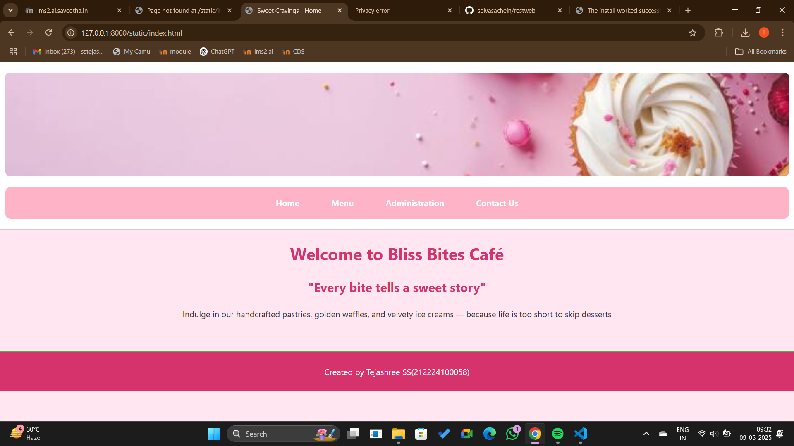
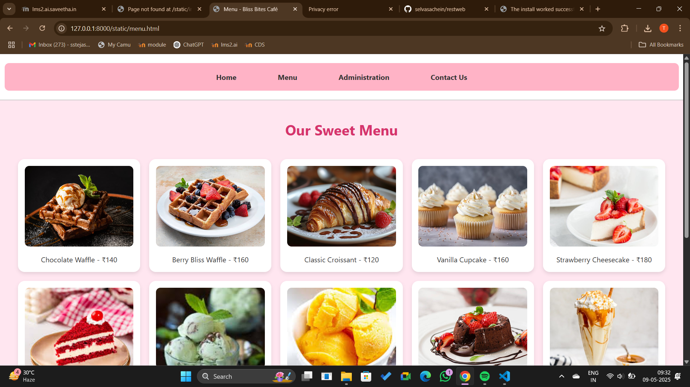
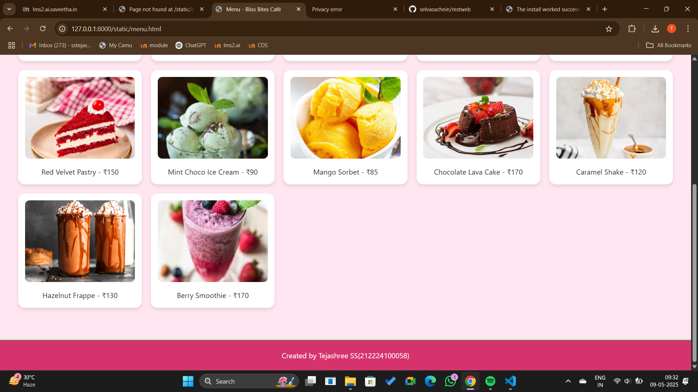
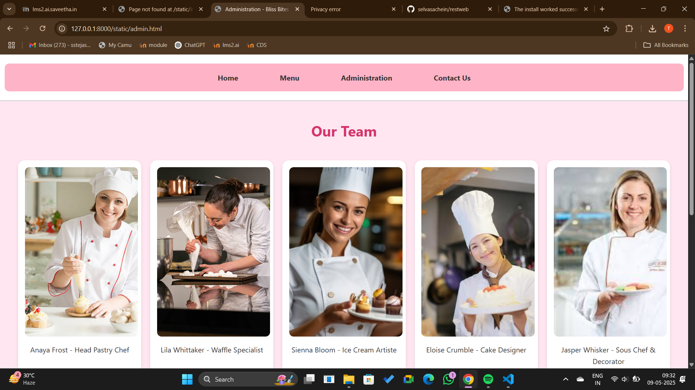
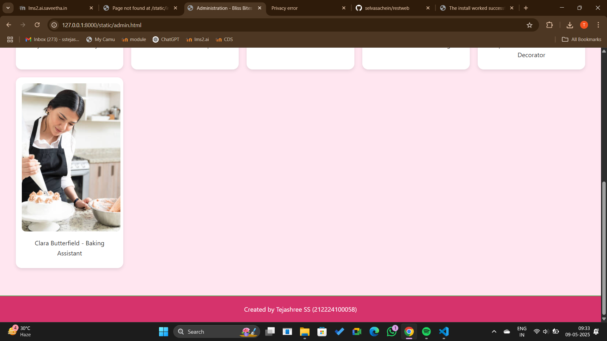
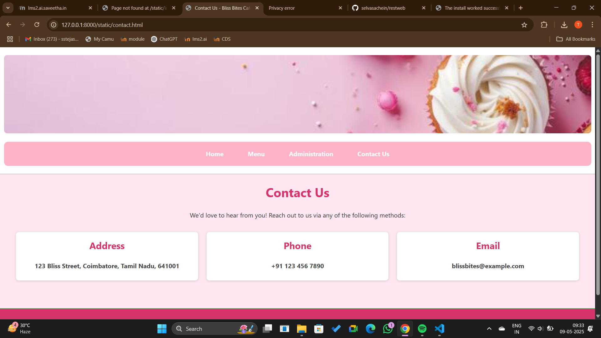

# Ex.07 Restaurant Website
## Date: 09/05/25

## AIM:
To develop a static Restaurant website to display the food items and services provided by them.

## DESIGN STEPS:

### Step 1:
Requirement collection.

### Step 2:
Creating the layout using HTML and CSS.

### Step 3:
Updating the sample content.

### Step 4:
Choose the appropriate style and color scheme.

### Step 5:
Validate the layout in various browsers.

### Step 6:
Validate the HTML code.

### Step 7:
Publish the website in the given URL.

## PROGRAM:
```
index.html
<!-- index.html -->
<!DOCTYPE html>
<html lang="en">
<head>
  <meta charset="UTF-8">
  <title>Sweet Cravings - Home</title>
  <link rel="stylesheet" href="style.css">
</head>
<body>
  <header>
    
    <nav>
      <ul>
        <li><a href="index.html">Home</a></li>
        <li><a href="menu.html">Menu</a></li>
        <li><a href="admin.html">Administration</a></li>
        <li><a href="contact.html">Contact Us</a></li>
      </ul>
    </nav>
  </header>
  <main>
    <h1>Welcome to Bliss Bites Café</h1>
    <h2>"Every bite tells a sweet story"</h2>
    <p>Indulge in our handcrafted pastries, golden waffles, and velvety ice creams — because life is too short to skip desserts</p>
  </main>
  <footer>
    <p>Created by Tejashree SS(212224100058)</p>
  </footer>
</body>
</html>

menu.html
<!-- menu.html -->
<!DOCTYPE html>
<html lang="en">
<head>
  <meta charset="UTF-8">
  <title>Menu - Bliss Bites Café</title>
  <link rel="stylesheet" href="style.css">
  <style>
    body {
      background-color: #ffe6f0;
      font-family: Arial, sans-serif;
      margin: 0;
      padding: 0;
    }

    nav ul {
      display: flex;
      justify-content: center;
      list-style-type: none;
      padding: 10px;
      background-color: #ffb3c6;
      margin: 0;
    }

    nav ul li {
      margin: 0 15px;
    }

    nav ul li a {
      text-decoration: none;
      color: #333;
      font-weight: bold;
    }

    h1 {
      text-align: center;
      color: #d6336c;
      padding-top: 20px;
    }

    .menu-grid {
      display: grid;
      grid-template-columns: repeat(auto-fit, minmax(250px, 1fr));
      gap: 20px;
      padding: 20px;
    }

    .menu-item {
      background: white;
      border-radius: 15px;
      padding: 15px;
      text-align: center;
      box-shadow: 0 4px 8px rgba(0, 0, 0, 0.1);
    }

    .menu-item img {
      width: 100%;
      height: 180px;
      object-fit: cover;
      border-radius: 10px;
    }

    .menu-item p {
      margin: 10px 0 0;
      font-size: 16px;
      color: #333;
    }

    footer {
      background: #d6336c;
      color: white;
      text-align: center;
      padding: 10px;
      margin-top: 30px;
    }
  </style>
</head>
<body>
  <header>
    <nav>
      <ul>
        <li><a href="index.html">Home</a></li>
        <li><a href="menu.html">Menu</a></li>
        <li><a href="admin.html">Administration</a></li>
        <li><a href="contact.html">Contact Us</a></li>
      </ul>
    </nav>
  </header>
  <main>
    <h1>Our Sweet Menu</h1>
    <div class="menu-grid">
      <div class="menu-item">
        
        <p>Chocolate Waffle - ₹140</p>
      </div>
      <div class="menu-item">
        
        <p>Berry Bliss Waffle - ₹160</p>
      </div>
      <div class="menu-item">
        
        <p>Classic Croissant - ₹120</p>
      </div>
      <div class="menu-item">
        
        <p>Vanilla Cupcake - ₹160</p>
      </div>
      <div class="menu-item">
        
        <p>Strawberry Cheesecake - ₹180</p>
      </div>
      <div class="menu-item">
        
        <p>Red Velvet Pastry - ₹150</p>
      </div>
      <div class="menu-item">
        
        <p>Mint Choco Ice Cream - ₹90</p>
      </div>
      <div class="menu-item">
        
        <p>Mango Sorbet - ₹85</p>
      </div>
      <div class="menu-item">
        
        <p>Chocolate Lava Cake - ₹170</p>
      </div>
      <div class="menu-item">
        
        <p>Caramel Shake - ₹120</p>
      </div>
      <div class="menu-item">
        
        <p>Hazelnut Frappe - ₹130</p>
      </div>
      <div class="menu-item">
        
        <p>Berry Smoothie - ₹170</p>
      </div>
    </div>
  </main>
  <footer>
    <p>Created by Tejashree SS(212224100058)</p>
  </footer>
</body>
</html>

admin.html
<!-- admin.html -->
<!DOCTYPE html>
<html lang="en">
<head>
  <meta charset="UTF-8">
  <title>Administration - Bliss Bites Café</title>
  <link rel="stylesheet" href="style.css">
  <head>
    <meta charset="UTF-8">
    <title>Administration - Bliss Bites Café</title>
    <link rel="stylesheet" href="style.css">
    <style>
      body {
        background-color: #ffe6f0;
        font-family: Arial, sans-serif;
        margin: 0;
        padding: 0;
      }
  
      .team-grid {
        display: grid;
        grid-template-columns: repeat(auto-fit, minmax(250px, 1fr));
        gap: 20px;
        padding: 20px;
      }
  
      .team-member {
        background: white;
        border-radius: 15px;
        padding: 15px;
        text-align: center;
        box-shadow: 0 4px 8px rgba(0,0,0,0.1);
      }
  
      .team-member img {
        width: 250px;
        height: 375px;
        object-fit: cover;
        border-radius: 10px;
      }
  
      h1 {
        text-align: center;
        color: #d6336c;
        padding-top: 20px;
      }
  
      footer {
        background: #d6336c;
        color: white;
        text-align: center;
        padding: 10px;
        margin-top: 30px;
      }
  
      nav ul {
        display: flex;
        justify-content: center;
        list-style-type: none;
        padding: 10px;
        background-color: #ffb3c6;
        margin: 0;
      }
  
      nav ul li {
        margin: 0 15px;
      }
  
      nav ul li a {
        text-decoration: none;
        color: #333;
        font-weight: bold;
      }
    </style>
</head>
<body>
  <header>
    <nav>
      <ul>
        <li><a href="index.html">Home</a></li>
        <li><a href="menu.html">Menu</a></li>
        <li><a href="admin.html">Administration</a></li>
        <li><a href="contact.html">Contact Us</a></li>
      </ul>
    </nav>
  </header>
  <main>
    <h1>Our Team</h1>
    <div class="team-grid">
      <div class="team-member"><p>Anaya Frost - Head Pastry Chef</p></div>
      <div class="team-member"><p>Lila Whittaker - Waffle Specialist</p></div>
      <div class="team-member"><p>Sienna Bloom - Ice Cream Artiste</p></div>
      <div class="team-member"><p>Eloise Crumble - Cake Designer</p></div>
      <div class="team-member"><p>Jasper Whisker - Sous Chef & Decorator</p></div>
      <div class="team-member"><p>Clara Butterfield - Baking Assistant</p></div>
    </div>
  </main>
  <footer>
    <p>Created by Tejashree SS (212224100058)</p>
  </footer>
</body>
</html>

contact.html
<!-- contact.html -->
<!DOCTYPE html>
<html lang="en">
<head>
  <meta charset="UTF-8">
  <title>Contact Us - Bliss Bites Café</title>
  <link rel="stylesheet" href="style.css">
</head>
<body>
  <header>
    
    <nav>
      <ul>
        <li><a href="index.html">Home</a></li>
        <li><a href="menu.html">Menu</a></li>
        <li><a href="admin.html">Administration</a></li>
        <li><a href="contact.html">Contact Us</a></li>
      </ul>
    </nav>
  </header>
  <main>
    <h1>Contact Us</h1>
    <p>We'd love to hear from you! Reach out to us via any of the following methods:</p>
    <section class="contact-info">
      <div class="contact-item">
        <h2>Address</h2>
        <p>123 Bliss Street, Coimbatore, Tamil Nadu, 641001</p>
      </div>
      <div class="contact-item">
        <h2>Phone</h2>
        <p>+91 123 456 7890</p>
      </div>
      <div class="contact-item">
        <h2>Email</h2>
        <p>blissbites@example.com</p>
      </div>
    </section>
  </main>
  <footer>
    <p>Created by Tejashree SS (212224100058)</p>
  </footer>
</body>
</html>


```

## OUTPUT:








## RESULT:
The program for designing software company website using HTML and CSS is completed successfully.
